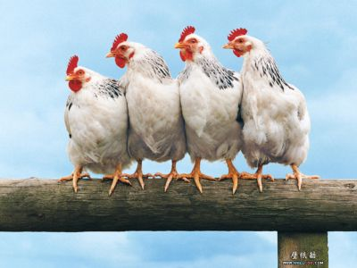

## Introduction

<p>Application is made for visualizing and summarizing <code>chickwts</code> 
dataset.</p>

<p>Click <a href="http://aleksandarn.shinyapps.io/chickApp/">here</a> to go to app.</p>

<p>Tab named <b>Plot</b> shows boxplot of chicken weights by feed type where different feed types can be selected from checkbox on the left side.</p>

<p>Tab <b>Summary</b> presents summary statistics of chicken weights by feed type. Here again one can use checkbox on the left side to choose from feed type variable.</p>


--- .class #id 

## chickwts data


<p>This dataset comes from an experiment were <i>"the effectiveness of various feed supplements on the growth rate of chickens was measured and compared"</i> (from R Documentation). Dataset has two variables: <code>weight</code> - a numeric variable giving the chick weight and <code>feed</code> - a factor giving the feed type.</p>


<figure>
  
  <figcaption><small>From: http://photos.congland.com/albums/uploads/fun/normal_Funny_chickens.jpg</small></figcaption>
</figure>

--- 

## Boxplot

```{r}
boxplot(chickwts$weight ~ chickwts$feed)
```

---


## Summary

```{r, echo=FALSE}
tapply(chickwts$weight, chickwts$feed, summary)[c(1, 6)]
```
